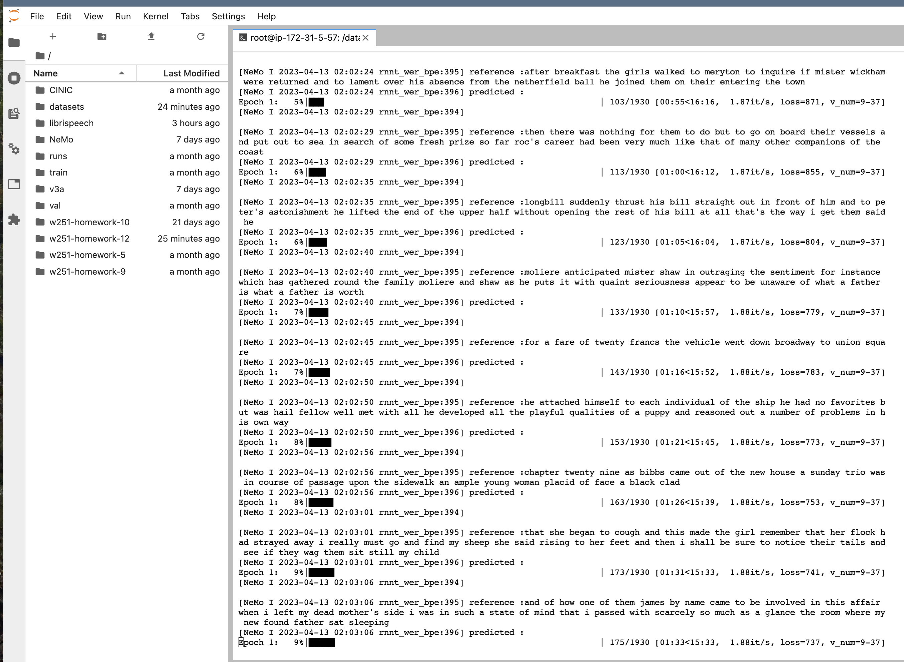
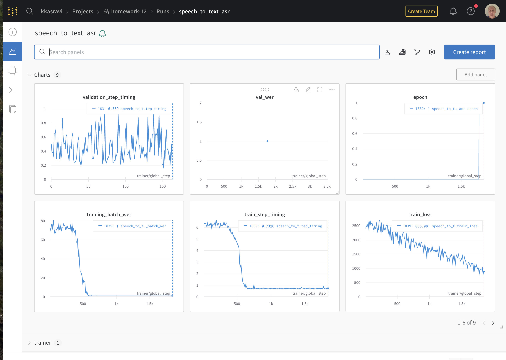

# w251-homework-12

This was run on an EC2 instance using a g5.2xlarge server

 

## Instructions to run

- run jupyterlab 
- connect to jupyterlab from browser 
- open a terminal in that environment (which uses nemo:latest container).

### Create tokenizer files

> make tokenizer

### Train the model

> make train

## Training Output

### Training  in progress

 

### Visualizations in progress on weights and biases

 

